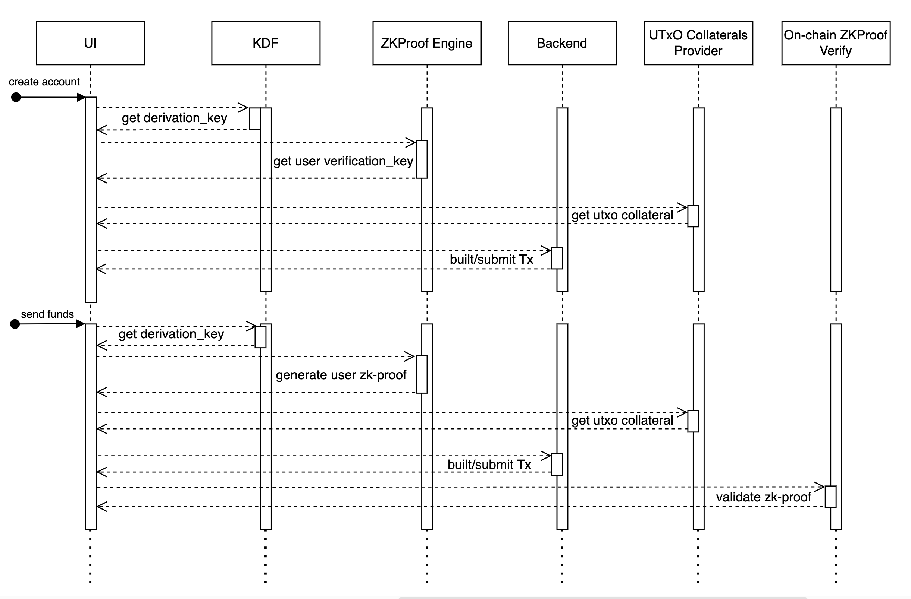

## What is Zero Knowledge Proofs?
Zero-knowledge proofs (ZKPs) are a cryptographic protocol that enables one party, known as the prover, to convince another party, the verifier, that a particular claim is true without disclosing any details about the claim itself. This concept was first introduced in a 1985 paper titled "**The knowledge complexity of interactive proof systems**" and has since been developed and improved for use in various applications.

In a ZKP, the prover strives to establish a claim, and the verifier is responsible for verifying the claim. The prover can demonstrate to the verifier that a statement is accurate without revealing any additional information regarding the statement. This is achieved by providing proof, or a small amount of information, that can be verified by the verifier to ensure that the statement is true.

### Benefits of Zero-Knowledge Proofs
Zero-knowledge proofs (ZKPs) offer a range of benefits, especially in applications where privacy, security, and efficiency are paramount. Below are some key advantages:

1. **Enhanced Privacy**
    - **Data Confidentiality:**
    ZKPs enable a party to prove knowledge of a secret (e.g., a password, transaction details, or other sensitive information) without revealing the secret itself. This ensures that sensitive data remains confidential throughout the verification process.
    - **Selective Disclosure:**
    Only the validity of the statement is revealed, not the underlying data. This is particularly valuable in systems where minimal exposure of personal or proprietary information is desired.
2. **Improved Security**
    - **Reduced Attack Surface:**
    Since no sensitive data is exposed during the verification process, the potential for data breaches or information leakage is significantly minimized.
    - **Resistance to Replay and Eavesdropping Attacks:**
    ZKPs typically incorporate cryptographic randomness and nonces, making it difficult for adversaries to reuse intercepted proofs or gain meaningful information by eavesdropping.
3. **Efficient and Scalable Verification**
    - **Succinct Proofs:**
    Many ZKP protocols, such as zk-SNARKs or zk-STARKs, produce small proofs that can be quickly verified, even by resource-constrained systems. This efficiency is particularly beneficial in blockchain environments, where on-chain computational resources are limited.
    - **Off-Chain Computation:**
    The heavy lifting of proof generation can be performed off-chain, while only the succinct proof is posted on-chain. This helps to reduce transaction sizes and lowers computational overhead for on-chain verification.
4. **Trustless and Decentralized Verification**
    - **No Need for Centralized Authorities:**
    ZKPs allow one party to verify the truth of a statement without having to trust a central authority or fully reveal all underlying data. This supports decentralized applications by ensuring that verification processes are transparent and trustless.
    - **Immutable Proofs on Blockchain:**
    When integrated into blockchain systems, zero-knowledge proofs can be stored on-chain, providing an immutable record that certain conditions were met without exposing sensitive details.
5. **Versatility Across Use Cases**
    - **Authentication:**
    Users can prove their identity or the correctness of credentials (e.g., a username and password combination) without exposing the actual credentials, thereby enhancing security in authentication systems.
    - **Compliance and Auditing:**
    ZKPs can be used to demonstrate compliance with regulatory or operational requirements (such as proving that a transaction adheres to certain rules) without disclosing all underlying data, simplifying audits and compliance checks.
    - **Interoperability:**
    They can facilitate secure interactions between different systems or parties by allowing proofs to be generated in one context and verified in another, supporting cross-platform or cross-organizational collaborations.

### Security and Privacy
While the inherent transparency of blockchains provides an advantage in many situations, there are also a number of smart contract use cases that require privacy due to various business or legal reasons, such as using proprietary data as inputs to trigger a smart contract’s execution. 

An increasingly common way privacy is achieved on public blockchain networks is through zero-knowledge proofs (ZKPs)—a method for one party to cryptographically prove to another that they possess knowledge about a piece of information without revealing the actual underlying information. In the context of blockchain networks, the only information revealed on-chain by a ZKP is that some piece of hidden information is valid and known by the prover with a high degree of certainty.

For blockchain projects based on ZKP protocols, there are a number of important security considerations to focus on. 

#### Zero-knowledge Proof Circuit
Ensuring the security, effectiveness, and scalability of the ZKP circuit used in a project is crucial. This involves a focus on several key areas, including circuit design, cryptographic primitive implementation, and protection of randomness. By carefully considering each of these factors, project teams can help to mitigate potential vulnerabilities and ensure the overall robustness of their ZKP system.

#### Circuit design errors
Currently, detecting errors in ZKP circuit design is a challenge due to the lack of reliable tools available. This can lead to the introduction of logic errors during the design process, which in turn can compromise the security properties of the proof process, including completeness, soundness, and zero-knowledge. For example, during the 2018 Zcash Sapling upgrade, a circuit design flaw was identified that could have allowed for the unlimited counterfeiting of ZEC tokens. Although this vulnerability was not exploited, it highlights the potential seriousness of circuit design errors in ZKP systems. 

#### Cryptographic primitives implementation errors
The correctness and security of a ZKP circuit relies heavily on the proper implementation of cryptographic primitives, including hash functions, encryption algorithms, and more. However, even a small error in the implementation of these primitives can compromise the security of the entire proof system. This issue is not unique to ZKP-proof systems, as evidenced by the vulnerability in BNB Chain’s Merkle tree validation primitives, which resulted in a loss of $586 million. It is crucial for developers to pay close attention to the implementation of cryptographic primitives and regularly audit their code to ensure the security of their systems.

#### Contract security
This is mainly aimed at Layer2 or privacy coin projects implemented through smart contracts. Smart contract security is self-evident. In addition to common vulnerabilities such as re-entrancy, injection, overflow, and permission bypass, for ZKP projects, smart contracts play a critical role in asset cross-chain and proof verification. Vulnerabilities in cross-chain message verification and proof verification can directly lead to the failure of reliability. 

## Zero Knowledge vs. Zero Trust
"Zero knowledge" refers to the specific cryptographic method of zero-knowledge proofs, while “zero trust” is a general cyber security model used by organizations to protect their data, premises, and other resources.

The zero-trust framework assumes that every person and device, both internal and external to the network, could be a threat due to malicious behavior or simple incompetence. To mitigate threats, zero-trust systems require users and devices to be authenticated, authorized, and continuously validated before access to resources is granted.

Zero-knowledge proofs can be used as part of a zero-trust framework. For example, zero-knowledge authentication solutions can allow employees to access their organization’s network, without having to reveal personal details.

## How Do Zero-Knowledge Proofs Work?
At a high level, a zero-knowledge proof works by having the verifier ask the prover to perform a series of actions (also called computations) that can only be performed accurately if the prover knows the underlying information. The prover and verifier interact in multiple rounds of the protocol, and in the conclusion, the verifier develops confidence in the veracity of the claim without learning any additional information about the secret.

The three fundamental characteristics that define a ZKP include:
- **Completeness**: If a statement is true, then an honest verifier can be convinced by an honest prover that they possess knowledge about the correct input.
- **Soundness**: If a statement is false, then no dishonest prover can unilaterally convince an honest verifier that they possess knowledge about the correct input.
- **Zero-knowledge**: If the state is true, then the verifier learns nothing more from the prover other than the statement is true.

## Types of Zero-Knowledge Proofs
There are various implementations of ZKPs, with each having its own trade-offs of proof size, prover time, verification time, and more. They include:

- **zk-SNARKs**
Also referred to as “Zero-Knowledge Succinct Non-Interactive Argument of Knowledge”, is a type of zero-knowledge proof designed to be as short and efficient as possible, allowing for scalable and efficient verification. This type of proof is useful when building applications where proof size and speed are important considerations. Additionally, with zk-SNARKs, only the trusted systems can verify the validity of a proof.
    - ***Groth16***
    Groth introduced this [proof system](https://eprint.iacr.org/2016/260.pdf?ref=blog.lambdaclass.com) in 2016 and saw an early application in ZCash. The protocol relies on pairing-friendly elliptic curves, such as BN254, BLS12-381, BLS12-377, BLS24-315, BW6-633 or BW6-761. It's a proving schema whose proof size is among the smallest (consisting of only three elliptic curve elements) and fastest to verify. The main drawback is that it needs a trusted setup per program. In other words, we need to regenerate all the parameters whenever we want to prove a new program (or change the original one). Some projects that use Groth16 include ZCash, Loopring, Hermez, Celo, and Filecoin.
    - ***PlonK***
    PlonK is a universal preprocessing general-purpose zk-SNARK construction. The protocol can be instantiated with any of the following elliptic curves: BN254, BLS12-381, BLS12-377, BLS24-315, BW6-633 or BW6-761. It's a  proving scheme with a preprocessing phase that can be updated, and has a short and constant verification time. On the downside, PlonK proofs are bigger and slower to generate compared to Groth16. Some projects that use PlonK include Aztec, ZKSync, and Dusk.
- **zk-STARKs**
Also referred to as Zero-Knowledge Scalable Transparent Argument of Knowledge, is another type of Zero-Knowledge Proof considered transparent. This ZKP is useful for systems like blockchains and other public ledgers, with [Zcash](https://z.cash/technology/) being one of the first blockchains to implement this technology. With zk-STARKs, anyone can verify the statement's validity without being the verifier; however, note that this ZKP requires a larger proof size (10-100x) than zk-SNARKs. zk-STARKs derive from a combination of mathematical techniques which work together to ensure the integrity of the proof.
- **Bulletproofs**
Bulletproofs are short non-interactive zero-knowledge proofs that require no trusted setup. One major advantage of inner products is that they can model some problems "directly" (i.e. they don’t need an arithmetic circuit). For example the range proof is used by Monero to ensure that transactions do not have negative values in the input (i.e. an overflow in the finite field). 
ZCash uses Bulletproofs as a replacement for the SNARK polynomial commitment using a PLONKish circuit. The size of the proof is logarithmic, unlike the zk-SNARK proof which is constant size. Bulletproofs require no trusted setup, however verifying is more time consuming than verifying a zk-SNARK proof, this is because the work that would have been accomplished by the trusted setup now has to be done by the verifier.

## Native Compatibility with Cardano’s Cryptographic Environment
Cardano currently supports the BLS12-381 elliptic curve. Groth16 is typically implemented on pairing-friendly curves like BLS12-381, making it a natural fit. This native compatibility minimizes the engineering overhead that might be needed to adapt or optimize alternative protocols (which may rely on different cryptographic assumptions or curves).

### Proof Size and On-Chain Efficiency
Groth16 produces constant-size proofs (usually around 128 bytes), regardless of the complexity of the underlying statement. This small proof size is critical in a blockchain context like Cardano, where every byte counts toward transaction size and cost.

- **Succinct Proofs**
Groth16 produces constant-size proofs (usually around 128 bytes), regardless of the complexity of the underlying statement. This small proof size is critical in a blockchain context like Cardano, where every byte counts toward transaction size and cost.
- **Fast Verification**
One of the main advantages of Groth16 is its very efficient verification process. Fast on-chain verification is essential for a wallet where each action (i.e., a transaction) must be quickly validated. Groth16’s pairing-based verification is well-optimized on the BLS12-381 curve, ensuring that the verification time remains constant and low, which is crucial given Cardano's on-chain computational constraints.
- **Comparison with Alternatives**
    - **PLONK**: PLONK is a promising and versatile zk-SNARK protocol that offers benefits like universal setup. However, in terms of maturity, optimization, and current integration with BLS12-381, Groth16 has a slight edge—especially when every millisecond of verification time matters on-chain.
    - **zk-STARKs**: While zk-STARKs offer transparency (eliminating the need for a trusted setup), they tend to have significantly larger proof sizes and higher verification costs. In a wallet scenario with frequent on-chain interactions, these larger proofs could lead to increased transaction sizes and slower processing times.
    - **Bulletproofs**: Although Bulletproofs offer relatively small proofs for range proofs and similar statements, their verification time increases logarithmically with the complexity of the statement. For a wallet that must validate each transaction promptly, this can become a bottleneck.

### Maturity and Ecosystem Support
- **Well-Established Protocol**:
Groth16 is one of the most mature and widely deployed zk-SNARK protocols. Its extensive research, testing, and real-world usage provide a high level of confidence in its security and performance. This maturity is particularly important when deploying a product like a wallet, where security is paramount.
- **Optimized Implementations**:
There are numerous optimized libraries and toolkits available for Groth16 that are designed to work with BLS12-381. Leveraging these tools can accelerate development and ensure robust performance on the Cardano blockchain.

### Trusted Setup Considerations
- **One-Time Trusted Setup**:
Although Groth16 requires a trusted setup, this is generally a one-time cost. Once the trusted parameters are generated and securely distributed, they can be used for all subsequent proofs. In the context of a wallet, this trade-off is acceptable given the benefits of succinct proofs and fast verification. For many applications, including wallet transactions, the efficiency and scalability gains from Groth16 outweigh the inconvenience of an initial trusted setup phase.
- **Mitigation Strategies**:
There are established protocols and multi-party computation (MPC) ceremonies available to generate these trusted parameters in a decentralized and secure manner, further reducing concerns around the trusted setup.

### Potential security benefits and vulnerabilities
Blockchain wallets typically rely on asymmetric key cryptography, where the security of funds depends on the careful management of private keys. However, this paradigm often presents usability hurdles, especially for mainstream users. The concept of a “zk-proof wallet controlled by username and password” addresses these issues by:

- **Simplifying user authentication**: Allowing users to authenticate with familiar credentials.
- **Maintaining strong security guarantees**: Using zero-knowledge proofs to ensure that sensitive information (i.e password) is never exposed on-chain.
- **Improving user experience**: Lowering the barrier to entry for blockchain adoption.

## ZK Proof protocol selection
Given the constraints and requirements of deploying a wallet on Cardano, **zk-SNARKs using the Groth16 protocol** present the optimal balance of security, efficiency, and integration ease. Its native compatibility with the BLS12-381 curve, succinct proof size, and fast verification process make it superior to alternatives like PLONK, zk-STARKs, or Bulletproofs for this particular use case. The trade-offs, such as the need for a trusted setup, are mitigated by the protocol's maturity and available mitigation strategies, ensuring that every wallet action can be validated efficiently on-chain.

## Scalability considerations
Let's examine the resource usage (memory and CPU) of our Groth16 zk-proof verification function when deployed as an on-chain validator on Cardano. We discuss how the cost functions for each cryptographic operation contribute to the overall execution units and demonstrate that passing the maximum finite field value as each public input yields the worst-case scenario. This is especially relevant because the only variable cost arises in the `derive` function (specifically through the `g1.scale` operation) while all other operations are either constant cost or depend only on a fixed number of inputs.

### On-Chain Verification Code
Below is the core code for our on-chain zk-proof verification, including the recursive `derive` function that processes the public inputs:

```ts
pub fn zk_verify(
  proof: Proof,
  public: List<Scalar>,
  zkey: ZkVerificationKey,
) -> Bool {
  let pA = g1.decompress(proof.pA);
  let pB = g2.decompress(proof.pB);
  let pC = g1.decompress(proof.pC);

  let vk_acc =
    when zkey.vk_ic is {
      [] -> fail @"wrong vk_ic size"
      [ic0, ..tail] -> derive(tail, public, g1.decompress(ic0))
    };
// Pairing computations
  let eAB = pairing(pA, pB);
  let eAlphaBeta = pairing(g1.decompress(zkey.vk_alpha1), g2.decompress(zkey.vk_beta2));
  let eIGamma = pairing(vk_acc, g2.decompress(zkey.vk_gamma2));
  let eCDelta = pairing(pC, g2.decompress(zkey.vk_delta2));

  // Miller loop multiplications
  let mlr1 = bls12_381_mul_miller_loop_result(eAlphaBeta, eIGamma);
  let mlr2 = bls12_381_mul_miller_loop_result(mlr1, eCDelta);

  // Final verification step
  bls12_381_final_verify(eAB, mlr2)
}

// Computes the linear combination of public inputs: SUM(ic[i] * public[i])
pub fn derive(
  vk_ic: List<ByteArray>,
  public: List<Scalar>,
  result: G1Element,
) -> G1Element {
  when vk_ic is {
    [] -> result,
    [ic, ..vk_ic] ->
      when public is {
        [] -> fail,
        [sc, ..public] ->
          derive(vk_ic, public, g1.add(result, g1.scale(g1.decompress(ic), sc)))
      }
  }
}

pub fn pairing(g1: G1Element, g2: G2Element) -> MillerLoopResult {
  bls12_381_miller_loop(g1, g2)
}
```

> **Note:**  In this code, the only variable cost computation is in the `derive` function. Specifically, the `g1.scale` operation’s cost is linear with respect to the input scalar value, making it the critical point for our worst-case analysis.

#### Cost Functions for Operations
First let’s take a look at the two functions used to calculate the cost based on our code. These two functions are:
`OneArgumentCosting::constant_cost` calculated as (check [here](https://github.com/pragma-org/uplc/blob/main/crates/uplc/src/machine/cost_model/costing.rs#L154)):
```ts
TwoArguments::ConstantCost(c) => *c,
```

`TwoArgumentsCosting::linear_in_x` calculated as (check [here](https://github.com/pragma-org/uplc/blob/main/crates/uplc/src/machine/cost_model/costing.rs#L155)):
```ts
TwoArguments::LinearInX(l) => l.slope * x + l.intercept,
```
As you may have noticed, only `linear_in_x` function depends on inputs.
The following are the cost functions used in our on-chain verification process:

**G1 Point Decompression ([g1.decompress](https://github.com/pragma-org/uplc/blob/647490853b11cd6ed3b46eac5fb4b0ae720754d4/crates/uplc/src/machine/cost_model/builtin_costs.rs#L827))**:
```ts
bls12_381_g1_uncompress: OneArgumentCosting::new(
    OneArgumentCosting::constant_cost(18),
    OneArgumentCosting::constant_cost(52_948_122),
)
```

**G2 Point Decompression ([g2.decompress](https://github.com/pragma-org/uplc/blob/647490853b11cd6ed3b46eac5fb4b0ae720754d4/crates/uplc/src/machine/cost_model/builtin_costs.rs#L855))**:
```ts
bls12_381_g2_uncompress: OneArgumentCosting::new(
    OneArgumentCosting::constant_cost(36),
    OneArgumentCosting::constant_cost(74_698_472),
)
```
**G1 Addition ([g1.add](https://github.com/pragma-org/uplc/blob/647490853b11cd6ed3b46eac5fb4b0ae720754d4/crates/uplc/src/machine/cost_model/builtin_costs.rs#L807))**:
```ts
bls12_381_g1_add: TwoArgumentsCosting::new(
    TwoArgumentsCosting::constant_cost(18),
    TwoArgumentsCosting::constant_cost(962_335),
)
```

**Miller Loop ([bls12_381_miller_loop](https://github.com/pragma-org/uplc/blob/647490853b11cd6ed3b46eac5fb4b0ae720754d4/crates/uplc/src/machine/cost_model/builtin_costs.rs#L863))**:
```ts
bls12_381_miller_loop: TwoArgumentsCosting::new(
    TwoArgumentsCosting::constant_cost(72),
    TwoArgumentsCosting::constant_cost(254_006_273),
)
```


**Multiplication of Miller Loop Results ([bls12_381_mul_ml_result](https://github.com/pragma-org/uplc/blob/647490853b11cd6ed3b46eac5fb4b0ae720754d4/crates/uplc/src/machine/cost_model/builtin_costs.rs#L867))**:
```ts
bls12_381_mul_ml_result: TwoArgumentsCosting::new(
    TwoArgumentsCosting::constant_cost(72),
    TwoArgumentsCosting::constant_cost(2_174_038),
)
```


**Final Verification ([bls12_381_final_verify](https://github.com/pragma-org/uplc/blob/647490853b11cd6ed3b46eac5fb4b0ae720754d4/crates/uplc/src/machine/cost_model/builtin_costs.rs#L871))**:
```ts
bls12_381_final_verify: TwoArgumentsCosting::new(
    TwoArgumentsCosting::constant_cost(1),
    TwoArgumentsCosting::constant_cost(333_849_714),
)
```

**G1 Scalar Multiplication ([g1.scale](https://github.com/pragma-org/uplc/blob/647490853b11cd6ed3b46eac5fb4b0ae720754d4/crates/uplc/src/machine/cost_model/builtin_costs.rs#L815))**:
```ts
bls12_381_g1_scalar_mul: TwoArgumentsCosting::new(
    TwoArgumentsCosting::constant_cost(18),
    TwoArgumentsCosting::linear_in_x(76_433_006, 8_868),
)
```

The cost here is computed as: `cost = slope × x + intercept` where `x` is the scalar value. Using the maximum finite field number ensures that this linear cost is maximized. Linking these cost functions to the respective parts of the code helps us pinpoint where most of the resource consumption occurs.

#### Memory Cost Calculation
The memory usage for different elements is computed as follows: (check [here](https://github.com/pragma-org/uplc/blob/647490853b11cd6ed3b46eac5fb4b0ae720754d4/crates/uplc/src/machine/cost_model/value.rs#L112))
**G1 Element Memory Usage**:
```ts
pub fn g1_element_ex_mem() -> i64 {
    size_of::<blst::blst_p1>() as i64 / 8
}
```

**G2 Element Memory Usage**:
```ts
pub fn g2_element_ex_mem() -> i64 {
    size_of::<blst::blst_p2>() as i64 / 8
}
```

**Miller Loop Result Memory Usage**:
```ts
pub fn ml_result_ex_mem() -> i64 {
    size_of::<blst::blst_fp12>() as i64 / 8
}
```

These calculations ensure that even in the worst-case scenario, the memory consumption remains well below the Cardano cap of 14,000,000 units.

## Scalability Analysis

### Resource Caps and Test Results
- **Memory**:
In our worst-case test, the memory consumption was measured at 77,224 units, which is approximately 0.55% of the maximum allowed memory (14,000,000 units).
- **CPU**:
The CPU cost for the worst-case scenario was 2,407,510,451 steps, representing about 24% of the total CPU steps limit (10,000,000,000).

### Impact of Public Input Values
- **Fixed Number of Inputs**:
Our verification always processes 4 public inputs (`userId`, `challenge`, `challenge_flag`, and `hash`). Since the number of inputs is constant, the variable cost arises solely from the operations performed on these inputs.
- **Variable Cost in `derive`**:
The `derive` function is the only part of the validator where costs can vary with the input values. In particular, the `g1.scale` operation has a linear cost function based on the scalar value provided. By passing the maximum finite field value: `52435875175126190479447740508185965837690552500527637822603658699938581184512` ([scalar.field_prime](https://github.com/aiken-lang/stdlib/blob/2.2.0/lib/aiken/crypto/bls12_381/scalar.ak#L22) - 1) for each public input, we ensure that this linear cost is maximized.
- **Worst-Case Guarantee**:
Because all other operations (such as point `decompressions`, `additions`, and `pairing` functions) have fixed or constant costs, using the maximum finite field values in our test guarantees that we are measuring the maximum exUnits possible for both memory and CPU. This approach validates that even under the worst-case input scenario, the execution units remain within the acceptable limits for on-chain execution on Cardano.
- **Testing Transaction Analysis**
In an additional testing transaction—where the zk-proof is validated to allow sending funds without optimizations (such as passing the smart contract as a reference)—the following costs were recorded:
***Memory***: 476,322 units (approximately 3.4% of the maximum)
***CPU***: 2,977,953,660 steps (approximately 29.78% of the maximum)
These figures, higher than those seen in the isolated worst-case proof validation, reflect the added overhead of a full transaction context. Even so, the costs remain within Cardano's operational limits, demonstrating the robustness and scalability of the system even under less optimized conditions.

## Protocol-integrated security measures to protect user data and wallet integrity
Janus wallet protocol uses a zk-proof circuit accepting 4 public inputs (`userId`, `challenge`, `challenge_flag` and a `hash`) and a private input (the password) generating a commitment hash effectively binding all those inputs together. 


**Minimum Password Length and Complexity**:
Enforce a strong password policy on the application layer. For example, require that passwords be at least 12 characters long and include a mix of uppercase and lowercase letters, numbers, and special symbols. This helps mitigate offline dictionary attacks, since the circuit’s verification is deterministic once the input is provided.

**User Identifier Selection**:
Although `userId` is public, it should not be a simple, easily guessable value (such as an email or common username). Instead, we’ll use a unique or randomized identifier. This not only strengthens the binding between the proof and the user but also reduces the risk of targeted brute-force attempts.

**Input Sanitization and Preprocessing**:
Ensure that both `userId` and `pwd` inputs are sanitized and validated before being processed by the circuit. For `pwd` we’ll be applying a key derivation function (**KDF**) off-chain to further enhance security by incorporating additional randomness (or “salt”), which would make precomputation attacks impractical.

**Dynamic Challenge**:
Without additional safeguards, a valid zk-proof could potentially be reused by malicious actors to authorize multiple transactions. To mitigate this risk, Janus Wallet incorporates a dynamic `challenge` into the final commitment. This `challenge` is derived by hashing all transaction data (including inputs, outputs, certificates, and other relevant elements) similar to how a transaction hash is normally created by Cardano protocol. Because the resulting hash may exceed the `scalar.field_prime`, a flag (`challenge_flag`) is also introduced to accurately represent each transaction zk-proof.


By feeding this transaction specific challenge into the commitment circuit, the protocol ensures that each zk-proof is uniquely tied to its corresponding transaction. As a result, a proof generated for one transaction cannot be reused for any other, effectively eliminating the possibility of replay attacks. This design significantly enhances the overall security, reliability, and usability of the wallet.

## Scope of the Product and Required Architecture for Success
Janus Wallet is a cryptographic, browser-based wallet designed to enable users to sign Cardano transactions using a **username/password authentication system** instead of traditional seed phrases. It leverages **Zero-Knowledge Proofs (Groth16)** to authenticate users securely without exposing sensitive information. The wallet will support fundamental blockchain operations, including:
- Sending funds
- Delegating to stake pools
- Withdrawing staking rewards

For security reasons, all cryptographic operations, including **zkProof generation**, will be performed **on the client-side** to ensure that private data never leaves the user's machine. The backend will facilitate transaction submission and provide **collateral UTxOs** when needed. The product will initially be delivered as a **web application**, with potential expansion into a Chrome extension for better integration with decentralized applications (dApps).

To ensure security, usability, and scalability, Janus Wallet will have the following key architectural components:

1. **Client-Side ZK Proof Generation**
    - Users generate zkProofs on their device to authenticate transactions securely.
    - A challenge (derived from the transaction hash) is incorporated to prevent replay attacks.
    - Proofs are submitted alongside transactions for verification.
2. **Backend API Services**
    - Provides access to collateral UTxOs required for transaction construction.
    - Forwards user-submitted transactions to the Cardano blockchain.
    - Relies on existing Cardano providers (e.g., Maestro, Blockfrost) or a dedicated node for blockchain interactions.
3. **Smart Contracts for Verification**
    - Verify zkProofs before authorizing any transaction.
    - Prevent replay attacks by ensuring each proof is valid for a single transaction only.
    - Enforce security constraints within Cardano’s smart contract framework.
4. **Blockchain Interaction**
    - The system requires access to a Cardano node and relevant tooling (e.g., Ogmios) to submit transactions.
    - Uses third-party providers when necessary to simplify infrastructure requirements for the Proof of Concept (PoC).

This architecture ensures that user security is maintained, transactions remain valid, and the system can scale efficiently as adoption grows. By leveraging zk-proofs and integrating seamlessly with the Cardano blockchain, Janus Wallet provides a secure, user-friendly, and decentralized authentication solution for Web3 transactions.


1. **Account Creation (One-Time Setup)**
    - User provides **username** and **password** in the UI.
    - **KDF** (Key Derivation Function) generates a ***salt***, which is stored securely in the Backend API’s Salt Storage DB. This salt will be used to generate the password for all future ZK proofs.
    - **ZKProof engine** (`snarkjs` and `ffjavascript`) generate user’s verification_key.json.This key is what will be used along with the zk-proof to validate on-chain. In order to make it available and transparent that data will be minted into a NFT that’ll reference the user. The smart contract will enforce the use of such NFT as reference on each transaction.
    - Transaction must provide collateral, so we’ll ask for it from the **UTxO collateral provider**.
    - Finally the backend will build the tx and mint the NFT with the data.
2. Signing a Transaction (e.g., Sending Funds)
    - User enters **username** and **password** in the UI.
    - **Backend API** retrieves the corresponding salt from Salt Storage DB.
    - **KDF** derives the final password from (password + salt).
    - The **ZKProof engine** generates the zk-proof using this password.
    - The proof is sent to the** Backend API**, which:
        - Transaction must provide collateral, so we’ll ask for it from the **UTxO collateral provider**
        - Constructs the transaction and submits it via Tx Submission API.
    - Once the transaction reaches the Cardano Blockchain, the Smart Contract is triggered:
        - It **verifies the zk-proof** before allowing the transaction.

